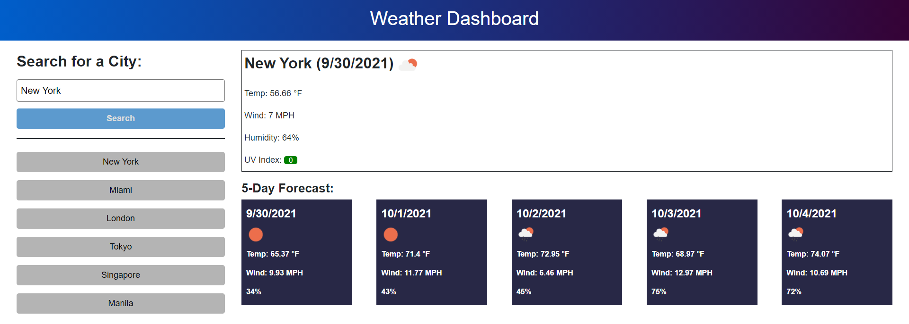

# WeatherDashboard

## Description
This repository hosts the code for an interactive weather dashboard. Using the Open Weather API, users can search the current weather and a 5 day weather forecast for a city. Additionally, previous searches will also be saved.

## Usage
The homepage can be viewed via Github pages using the following link: [Weather Dashboard](https://djamz919.github.io/WeatherDashboard/)

Users can search for a city using the form and the current weather and a five-day forecast for that city will be displayed. Additionally, if the search is new, the city will be added to the "search list" on the bottom left. The user will be able to redisplay the weather information from any previous searches by clicking the city on the search list.

